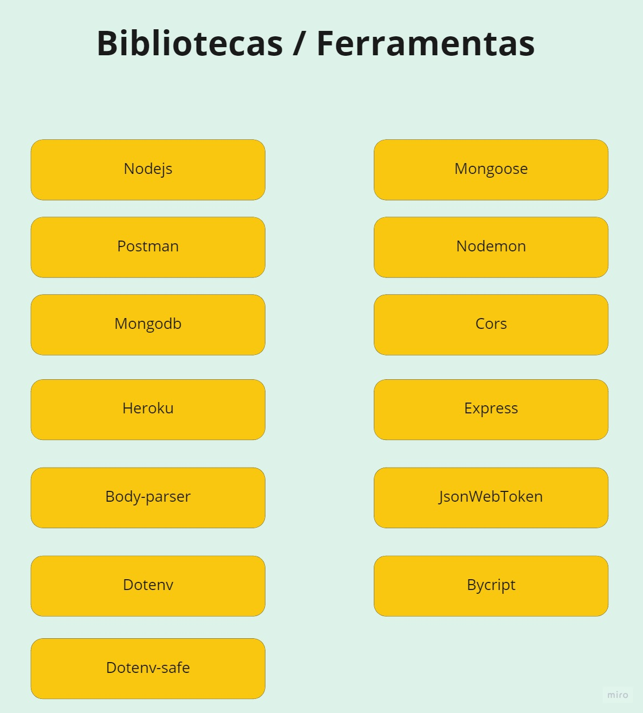

# REST API com CRUD, NODE.js e MongoDB

Esse projeto foi desenvolvido para a conclusão do bootcamp **{REPROGRAMA} XP.inc**. O projeto começou com um problema real que eu tenho no dia-a-dia, levar minha pet para ir comigo a diversos lugares sem me preocupar se ela pode ou não entrar. Foi assim que surgiu a **API- PETFRIENDLY**.

A intenção desta aplicação é permitir aos utilizadores inserirem locais PetFriendly na base de dados mongoDB, a base crescerá com a inserção de registros dos utilizadores(as) e os usuários(clientes) poderão acessar e comentar sobre os locais disponibilizados.

## Breve explicação das tecnicas usadas. 

**mongoose** = biblioteca wrapper 

**process.env** = vai pegar as variáveis de ambiente, é usado para vc subir para o heroku ou outra plataforma/servidor. 

**express** = ajuda a fazer a tratativa de rotas e requests http

**body-parser** = faz com que o node entenda as requesições, recebendo as informações json e que ele possa entender os parametros de url

**config ()** =método que vai buscar as variáveis de ambiente que estão no .env 

**Dotenv.** = Essa é a ferramenta utilizada para orquestrar as variáveis ambiente de um projeto. O nome dela sugere o arquivo em que as informações ficarão.
env.exemplo = consegue criar as variaveis de ambiente, templete que o .env vai usar como guia 

**Hash** = função matemárica aplicada sobre um conjunto de dados que gera outro número. Algoritmo usado na aplicação bcrypt

**Token JWT** = é um padrão (RFC-7519) que define como transmitir e armazenar objetos Json de forma compacta e segura. 

**jwt.sign** = É formado por três seções: Header, Payload e Signature. Formado através de informações que vem do seu usuário  gerando um token em cima da informaçào que você passar

**Signature do Token** = concatenação do Header + Payload + Secret
Secret = é a chave que vamos usar para gerar o token

**Autenticação** = ele basicamente fa a seguinte pergunta: Quem é você? verificar senha e email (login de acesso)

**heroku** = servidor na nuvem, permite que outros usuários utilizem nossas aplicações

## Como foi o processo de criação da aplicação ?

O primeiro passo foi eu entender exatamente o que eu queria fazer, então construi uma espécie de narrativa visual do que seria o projeto. Nela eu consigo visualizar os schemas que seriam utilizados, tipos de controller que eu poderia desenvolver e até mesmo a autenticação de email e senha. 
Fiz um tamplete utilizando o adobe Xd (lembrando que essa aplicação contém apenas o back-end).

