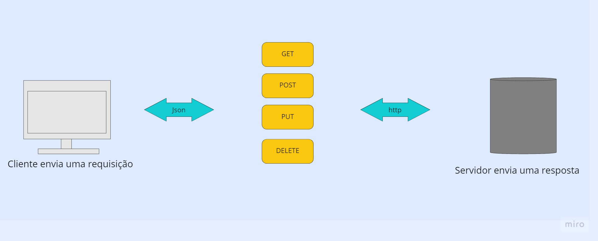
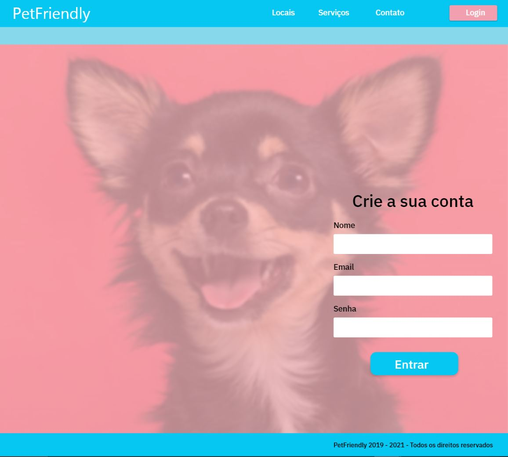
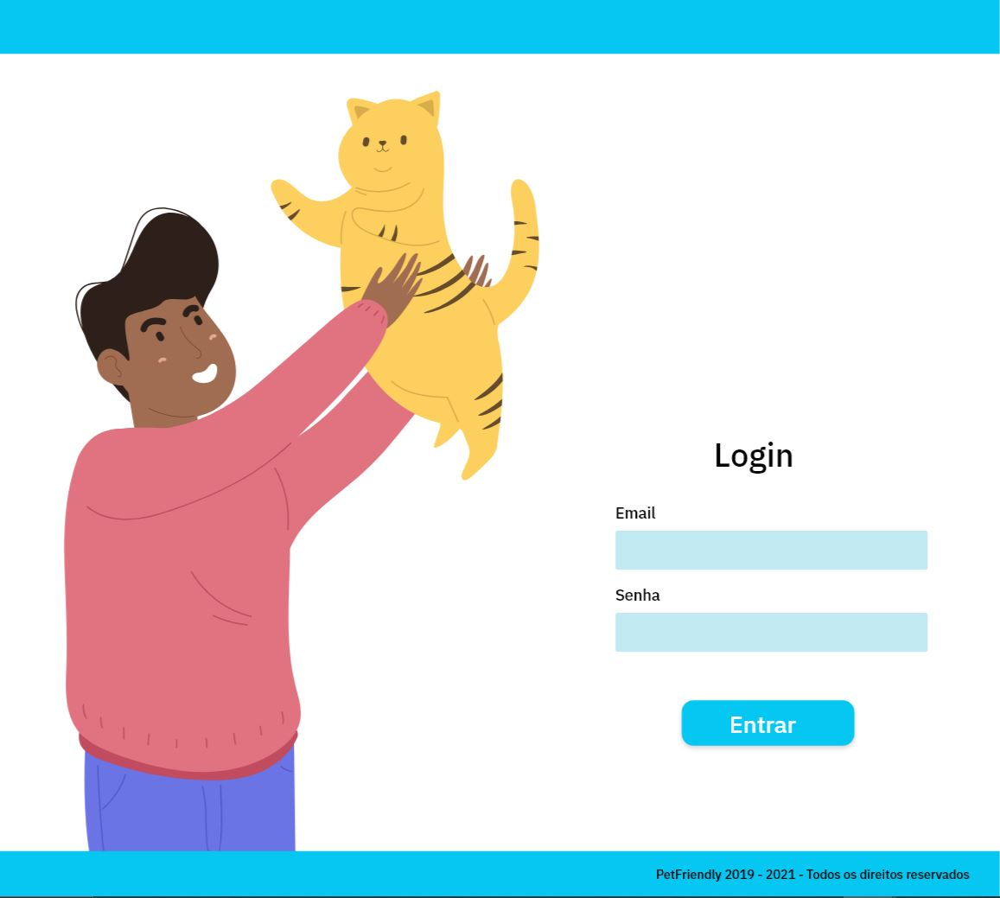
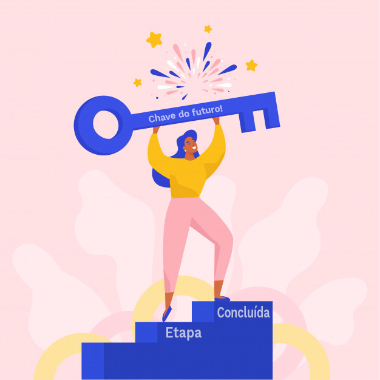

# REST API com CRUD, NODE.js e MongoDB



Esse projeto foi desenvolvido para a conclusão do bootcamp **{REPROGRAMA} XP.inc**. O projeto começou com um problema real que eu tenho no dia-a-dia, levar minha pet para ir comigo a diversos lugares sem me preocupar se ela pode ou não entrar. Foi assim que surgiu a API **PetFriendly**.

O que é **PetFriendly**? A grosso modo, a definição deste conceito é um local público ou privado que está adaptado para receber pets - ou seja, disponibiliza alguma área externa ou interna mas adequada para o animal permanecer; disponibiliza água para o animal; tem seus funcionários treinados para não desrespeitar o dono do pet; nem maltratar ou agir de forma violenta com os animais.

## Objetivo ## 

O propósito desta aplicação é permitir aos utilizadores e utilizadoras (programadores e programadoras que vierem a usar a API) inserirem lojas, restaurantes,  comércios, empresas, parques, locais públicos, privados etc que são **PetFriendly** na base de dados mongoDB.

A base irá crescer conforme forem inseridos os registros dos utilizadores(as). A API tem grande potencial. Num futuro breve, quando houver uma  quantidade razoável de informações cadastradas, será possível pensar em  novas funcionalidades, como mapeamento e geolocalização destes locais, avaliações positivas e negativas etc. 

A ideia é facilitar a vida dos usuários finais (clientes), para que eles possam acessar esta base de forma amigável, encontrar locais **PetFriendly**, deixar seus próprios comentários e avaliações sobre os estabelecimentos disponibilizados etc.

## Para utilizar essa API você vai precisar:
 


 - [VSCode](https://code.visualstudio.com/)
 - [nodejs](https://nodejs.org/)
 - [mongodb](https://www.mongodb.com/)
 - [npm](https://www.npmjs.com/)
 - [nodemon](https://www.npmjs.com/package/nodemon)
 - [mongoose](https://www.npmjs.com/package/mongoose)
 - [express](https://www.npmjs.com/package/express)
 - [cors](https://www.npmjs.com/package/cors)
 - [dotenv](https://www.npmjs.com/package/dotenv)
 - [jwt](https://jwt.io/)
 - [postman](https://www.postman.com/)
 - [body-parser](https://www.npmjs.com/package/body-parser)
 - [bycript](https://www.npmjs.com/package/bcrypt)


## Breve explicação das tecnologias usadas e aprendidas! 

**mongoose** = biblioteca wrapper 

**process.env** = vai pegar as variáveis de ambiente, é usado para vc subir para o heroku ou outra plataforma/servidor. 

**express** = ajuda a fazer a tratativa de rotas e requests http

**body-parser** = faz com que o node entenda as requisições, recebendo as informações json e que ele possa entender os parâmetros de url

**config ()** = método que vai buscar as variáveis de ambiente que estão no .env 

**Dotenv.** = Essa é a ferramenta utilizada para orquestrar as variáveis de ambiente de um projeto. O .env sugere o arquivo em que as informações ficarão. O **env.exemplo** consegue criar as variaveis de ambiente, template que o .env vai usar como guia 

**Hash** = função matemática aplicada sobre um conjunto de dados que gera outro número. Algoritmo usado na aplicação bcrypt

**Token JWT** = é um padrão (RFC-7519) que define como transmitir e armazenar objetos Json de forma compacta e segura. 

**jwt.sign** = É formado por três seções: Header, Payload e Signature. Formado através de informações que são fornecidas pelo usuário, gerando um token sobre a informação passada

**Signature do Token** = concatenação do Header + Payload + Secret.
O **secret** é a chave que a ser utilizada para gerar o token

**Autenticação** = Elemento que serve para confirmar a identidade do usuário através da verificação da senha e email (login de acesso)

**heroku** = Servidor na nuvem. Permite que outros usuários utilizem as aplicações


## Endpoints

Método | Caminho | Descrição
------ | ------- | ---------:
// | **ROTA** |**lugares**|
GET | /lugares | Retorna todos os lugares.
GET | /tipo/:tipo | Retorna uma lista de lugares com o mesmo tipo.
GET | /nome/:nome | Retorna um lugar por nome.
GET | /id/:id | Retorna um lugar específico.
POST| /criar| adiciona um lugar.
PUT | /atualizar/:id | Retorna um lugar específico.
DELETE | /delete/:id | Deleta um lugar.
POST| /comentar| cria um comentário.
// | **ROTA** | **users**
GET | /ver | Retorna todos os comentários.
POST | /create | Adiciona um usuário.
POST | /login | confere usuário
GET | /users| retorna todos os usuários cadastrados.
DELETE | /id/:id | Deleta um produto.


## Como foi o processo de criação da aplicação?

O primeiro passo foi entender exatamente o que deveria ser feito e o que eu desejava fazer. Construí uma espécie de narrativa visual do que seria o projeto, que está detalhada abaixo. Nesta narrativa, é possível visualizar os schemas a serem utilizados, os tipos de controllers que podem ser desenvolvidos e até mesmo como acontece a autenticação utilizando endereço de email e senha. Criei um template utilizando Adobe XD. É importante lembrar que esta aplicação contém apenas o backend.






## Quais os aprendizados obtidos com esse projeto? 

Começar algo do zero sempre dá um friozinho na barriga. Muitas vezes é normal pensar que não irá concluir, que não não vai entregar a tempo, principalmente quando é algo muito novo na vida, como este bootcamp e este projeto tem sido na minha! 

O que posso dizer é que a cada dia na construção desta API, fui me desenvolvendo mais. Aprendi como corrigir novos erros, entender porque algumas coisas funcionam e outras não. Descobri ferramentas novas - o principal foi aprender como pesquisar, isso faz uma baita diferença! Hoje consigo olhar para o código e entender o que está acontecendo. Automaticamente me recordo do dia em que fiz o processo seletivo e fiquei sem dormir para poder entregar a calculadora a tempo e hoje estou aqui terminando este ciclo. 

````javascript
if (medo){
    return "respira e continua"

}else 
    if(criando confiaça){
        return "Você está chegando no seu objetivo"

}else{
    return "Parabéns você concluiu com êxito!"
}
````

## Só tenho o que agradecer. Obrigada pela oportunidade,
## {REPROGRAMA} e XP.inc ♥





